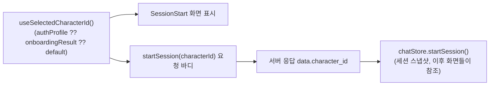

# 01. 채팅 AI 캐릭터가 항상 "미오"로 고정되는 문제 — 원인 분석 및 수정 계획

> 작성일: 2026-06-25
> 상태: 🟡 코드 수정 완료, 실기기 검증 대기 — 이 환경엔 시뮬레이터가 없어 수동 테스트는 사용자가 직접 확인 필요.
> 관련: [CHAT_STATUS_SUMMARY.md §5](../CHAT_STATUS_SUMMARY.md), 머지 커밋 `c973379`(`develop` → `feat/21-chat-api`, 2026-06-24)
> 참고: 이 문제는 같은 이름의 문서로 한 차례 분석됐었으나 커밋되지 않아 유실됐다(2026-06-23 작성 추정, 2026-06-24 확인 시점에 부재 확인). 이번이 재작성이며, 그사이 `c973379` 머지로 동일한 문제를 앱 다른 화면에서 해결한 패턴이 이미 들어와 있어 그 패턴을 그대로 따른다.

## 1. 문제 증상

마이페이지에서 AI 파트너를 "미오"가 아닌 다른 캐릭터(바우/루미/모모/치치)로 바꿔도, 채팅 탭에 들어가면 시작 화면(`SessionStart`)은 항상 "미오"로 표시되고, **대화 시작 버튼을 누르면 서버에도 `character_id: 'mio'`로 세션이 생성된다.** UI만 잘못 보이는 게 아니라 실제 세션 생성 데이터 자체가 틀어지는 문제다.

## 2. 원인

[chatStore.ts:47](../../src/features/chat/store/chatStore.ts#L47)의 초기 상태가 `'mio'`로 하드코딩돼 있고, 이 값은 `startSession()` 액션이 호출되기 전까지 절대 바뀌지 않는다.

```ts
characterId: 'mio', // TODO: useCharacter() 훅으로 서버에서 수신 후 대체
```

[SessionStart.tsx:53-54](../../src/features/chat/components/SessionStart.tsx#L53-L54)는 바로 이 초기값을 그대로 읽어서 화면에 보여주고,

```ts
// TODO: useCharacter() 훅으로 서버에서 수신 후 대체 (현재 store 기본값 'mio' 사용)
const characterId = useChatStore((s) => s.characterId);
```

같은 값을 [SessionStart.tsx:85](../../src/features/chat/components/SessionStart.tsx#L85) `startSession(characterId)` 호출에도 그대로 실어 보낸다. 즉 "화면 표시"와 "세션 생성 요청"이 같은 잘못된 source를 공유하고 있어서, 세션이 시작된 뒤에야 (서버가 돌려준 진짜 `character_id`로) 값이 맞게 고쳐진다.

반대로 세션이 이미 활성 상태일 때 `chatStore.characterId`를 읽는 곳들(`ChatMain.tsx`, `MessageBubble.tsx`, `SessionEnd.tsx`, `TypingIndicator.tsx`, `ChatHeader.tsx`)은 문제가 없다. 그 시점엔 이미 서버 응답으로 값이 덮어써진 뒤이기 때문이다:

- [useChat.ts:34-40](../../src/features/chat/hooks/useChat.ts#L34-L40) `useStartChatSession().onSuccess`가 `startSession(data.session_id, data.character_id, ...)`를 호출 — `data.character_id`는 서버 응답값.
- [chat/index.tsx:21-22](<../../src/app/(main)/chat/index.tsx#L21-L22>) 기존 활성 세션 재진입 시에도 `startSession(activeSession.session_id, activeSession.character_id)` — 역시 서버 응답값(`GET /v1/sessions/active`).

요약하면 **세션이 생성/복원된 "이후" 단계는 항상 서버 값을 쓰고 있어 정상**이고, 문제는 세션이 생성되기 "이전" 단계(`SessionStart` 화면)에서만 발생한다.

## 3. 참고 사례 — 머지 커밋 `c973379`가 같은 문제를 앱 다른 곳에서 이미 해결함

`c973379`(`develop` → `feat/21-chat-api` 머지, 2026-06-24)는 채팅과는 무관한 작업이었지만, `develop` 브랜치에서 "로그인해도 닉네임/캐릭터가 복원 안 되는" 문제([[user_profile_persistence_gap]] 메모리 참고)를 해결하면서 **앱 전역에서 같은 종류의 "현재 캐릭터" 분산 문제를 통합**했다. 그 방식을 그대로 채팅에 적용하면 된다.

### 3-1. 단일 source of truth: `useUserStore`

[userStore.ts](../../src/store/userStore.ts)가 `authProfile`(서버에서 확정된 값)과 `onboardingResult`(온보딩 중 임시 선택값)를 함께 들고, `zustand persist` + `SecureStore`([zustandStorage.ts](../../src/utils/zustandStorage.ts))로 앱 재시작에도 살아남는다.

```ts
export interface AuthProfile {
  nickname: string;
  characterId: string;
}

interface UserState {
  authProfile: AuthProfile | null; // 서버가 확정한 값 (로그인 응답에서 채워짐)
  onboardingResult: UserOnboardingSelectionResult | null; // 온보딩 중 임시 선택값
  // ...
}
```

이전에는 같은 개념이 `useUserStore.onboardingResult.characterId`(온보딩 1회성), `usePartnerStore.selectedPartner`(마이페이지 로컬 상태, persist 없음) 두 곳으로 흩어져 있었는데, `c973379`에서 `usePartnerStore`와 `useOnboardingStore`를 **완전히 삭제**하고 `useUserStore` 하나로 합쳤다.

### 3-2. 값이 채워지는 시점: 로그인 응답을 그대로 사용 (별도 API 호출 없음)

[useAuth.ts:40-50](../../src/features/auth/hooks/useAuth.ts#L40-L50) `useSocialLogin().onSuccess`:

```ts
onSuccess: async (res) => {
  await storage.refreshToken.set(res.data.refresh_token);
  setAccessToken(res.data.access_token);

  if (!res.data.is_new_user && res.data.signup_step === 'COMPLETED' && res.data.user) {
    useUserStore.getState().setAuthProfile({
      nickname: res.data.user.nickname,
      characterId: res.data.user.preferred_character_id,
    });
  }
},
```

[types/auth.ts:30-39](../../src/types/auth.ts#L30-L39)를 보면 로그인 API(`POST /v1/auth/login`) 응답(`AuthLoginData`)에 이미 `user: AuthUser | null`(닉네임/`preferred_character_id` 포함)이 들어 있다 — **별도로 `GET /v1/users/me`를 호출하는 게 아니라, 기존 로그인 응답을 활용**한 것이 핵심이다. 신규 가입 중이거나 온보딩이 안 끝난 사용자는 `user`가 `null`이라 이 분기를 안 타고, 대신 온보딩 진행 중엔 [useOnboardingSelection.ts](../../src/features/onboarding/hooks/useOnboardingSelection.ts)가 `patchOnboardingCharacterId()`로 `onboardingResult.characterId`를 채운다. 로그아웃 시엔 `useLogout`이 `useUserStore.getState().reset()` + `persist.clearStorage()`로 정리한다([useAuth.ts:93-112](../../src/features/auth/hooks/useAuth.ts#L93-L112)).

### 3-3. 읽는 쪽: 한 줄짜리 공용 훅

[useSelectedCharacterId.ts](../../src/hooks/useSelectedCharacterId.ts) 하나로 fallback 순서까지 캡슐화돼 있다:

```ts
export function useSelectedCharacterId() {
  const authProfileCharacterId = useUserStore((state) => state.authProfile?.characterId);
  const onboardingCharacterId = useUserStore((state) => state.onboardingResult?.characterId);
  const characterId =
    authProfileCharacterId ?? onboardingCharacterId ?? ONBOARDING_DEFAULT_CHARACTER_ID;

  return toOnboardingCharacterId(characterId); // 런타임 검증 후 OnboardingCharacterId로 단언
}
```

이 훅은 이미 홈([HomeScreen.tsx](../../src/features/home/components/HomeScreen.tsx)), 마이페이지([PartnerSelectScreen.tsx](../../src/features/mypage/components/PartnerSelectScreen.tsx), [SettingsScreen.tsx](../../src/features/mypage/components/SettingsScreen.tsx), [AccountSection.tsx](../../src/features/mypage/components/AccountSection.tsx)), 리포트([GrowthReportScreen.tsx](../../src/features/report/components/GrowthReportScreen.tsx) 등), 온보딩 완료 화면([OnboardingCompleteScreen.tsx](../../src/features/onboarding/components/OnboardingCompleteScreen.tsx))에 적용돼 있다. **채팅(`SessionStart.tsx`)만 빠져 있다** — 채팅 기능이 `feat/21-chat-api` 브랜치에서 별도로 개발되던 중이라 `develop`의 이 통합 작업과 합쳐질 기회가 없었기 때문.

## 4. 수정 계획

핵심은 `SessionStart.tsx`가 "세션이 시작되기 전" 캐릭터를 가져오는 곳을 `useChatStore`에서 `useSelectedCharacterId()`로 바꾸는 것 하나다. 세션이 시작된 "이후"에 쓰는 `chatStore.characterId`(세션 스냅샷)는 의도된 분리이므로 손대지 않는다 — [[chat-api-integration]] 메모리에 기록된 대로, 대화 중간에 마이페이지에서 캐릭터를 바꿔도 이미 시작한 세션은 끝까지 같은 캐릭터로 유지돼야 하기 때문이다.

| 파일                                                                    | 변경                                                                                                                                                                                                                                                           |
| ----------------------------------------------------------------------- | -------------------------------------------------------------------------------------------------------------------------------------------------------------------------------------------------------------------------------------------------------------- |
| [SessionStart.tsx](../../src/features/chat/components/SessionStart.tsx) | 54번 줄 `useChatStore((s) => s.characterId)` → `useSelectedCharacterId()`로 교체. 53번 줄 TODO 주석 제거. 나머지(표시, `CharacterAvatar`, `MockStartSessionErrorButtons`, `startSession(characterId)` 호출)는 같은 지역 변수를 그대로 쓰므로 추가 변경 불필요. |
| [chatStore.ts](../../src/features/chat/store/chatStore.ts)              | 47번 줄 TODO 주석만 정리(이제 "서버에서 수신 후 대체"가 아니라 "세션 시작 전엔 `useSelectedCharacterId()`를 쓰고, 시작 후엔 서버 응답이 덮어쓴다"는 의도를 반영). 기본값 `'mio'` 자체는 세션 시작 전까지 아무도 읽지 않게 되므로 그대로 둬도 무해함.           |

이렇게 고치면 두 흐름 모두 일관된 값을 쓰게 된다:



## 5. 체크리스트

- [x] `SessionStart.tsx`: `useSelectedCharacterId()`로 교체, TODO 주석 제거
- [x] `chatStore.ts`: 47번 줄 TODO 주석 정리
- [x] `tsc --noEmit` / `eslint` 통과 확인
- [ ] `EXPO_PUBLIC_USE_MOCK=true`로 마이페이지에서 캐릭터를 미오 외 다른 캐릭터로 변경 → 채팅 탭 진입 → 시작 화면에 바뀐 캐릭터가 보이는지 확인 (mock `startSession`은 [chat.ts:58-63](../../src/api/endpoints/chat.ts#L58-L63)에서 받은 `characterId`를 그대로 echo하므로 mock으로도 검증 가능) — **이 환경엔 시뮬레이터가 없어 미수행, 사용자 확인 필요**
- [ ] 대화 시작 후에도 같은 캐릭터가 유지되는지 (`ChatMain`/`MessageBubble`/`ChatHeader`/`SessionEnd`) — 사용자 확인 필요
- [ ] `EXPO_PUBLIC_USE_MOCK=false` 실서버 환경에서 동일 시나리오 + 네트워크 탭으로 `POST /v1/sessions` 요청 바디의 `character_id`가 올바른지 확인 — 사용자 확인 필요
- [ ] 기존 활성 세션 재진입 경로([chat/index.tsx:21-22](<../../src/app/(main)/chat/index.tsx#L21-L22>))에 회귀 없는지 확인 — 이 경로는 원래도 서버값을 썼으므로 영향 없을 것으로 예상되지만 한 번 더 확인
- [x] [CHAT_STATUS_SUMMARY.md §5](../CHAT_STATUS_SUMMARY.md) 갱신 (✅ 해결됨으로 이동, 본 문서 링크 추가)
- [x] [chat-trouble-shoot/00-INDEX.md](./00-INDEX.md) 목록 표에 1번 행 추가

## 6. 이번 수정 범위 밖 — 알려진 한계

`authProfile`은 **로그인 API 호출 시점에만** 채워진다([useAuth.ts:44](../../src/features/auth/hooks/useAuth.ts#L44)). 앱을 껐다 켤 때 도는 `restoreSession`/`useRefreshToken`(토큰 갱신만 수행, [[user_profile_persistence_gap]] 메모리 참고)은 `authProfile`을 다시 채우지 않으므로, `c973379` 배포 이후에도 한 번도 재로그인하지 않은 기존 사용자는 `authProfile`이 계속 `null`이고 `onboardingResult.characterId`(또는 최종 fallback `'mio'`)에 의존하게 된다. 이는 채팅만의 문제가 아니라 `useSelectedCharacterId()`를 쓰는 모든 화면에 동일하게 영향을 주는 앱 전역 이슈이며, 이번 채팅 수정과 독립적으로 이미 별도 메모리([[user_profile_persistence_gap]])에 기록돼 있다 — 이번 작업 범위에서는 다루지 않는다.
